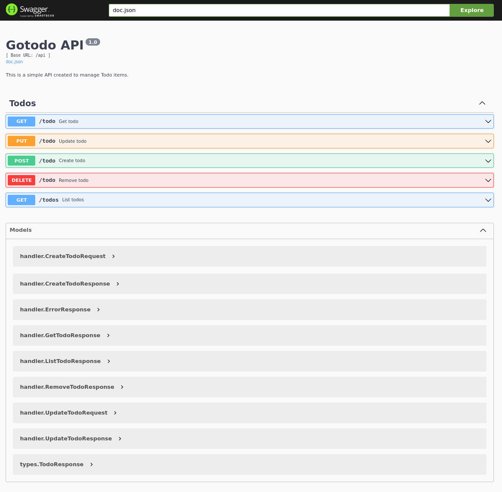

# Gotodo

A Web API built with Go. Manage todo items.

## Features 

- Create a todo item
- Remove a todo item
- Change a todo item
- List all todos items
- Update a todo item

## Technologies used

- Go
- SQLite
- [Swag](https://github.com/swaggo/swag) (Swagger docs)
- [GORM](https://gorm.io/index.html) (ORM library)
- [gin](https://github.com/gin-gonic/gin) (Web Framework)

## Demo

## Installation

To use this project, you need to follow these steps:

1. Clone the repository: `git clone https://github.com/rrxs/gotodo.git`
2. Install the dependencies: `go mod download`
3. Build the application: `go build`
4. Run the application: `./main`

The application should be running on port `8080`.

After that you can access swagger by hitting [http://localhost:8080/swagger/index.html](http://localhost:8080/swagger/index.html#/) 
